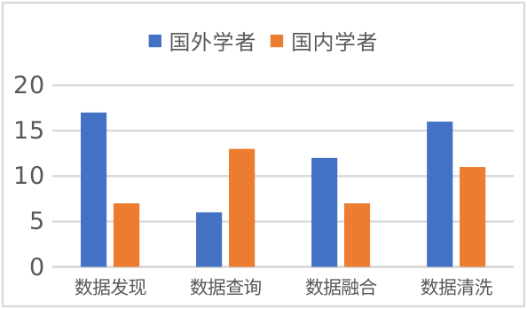
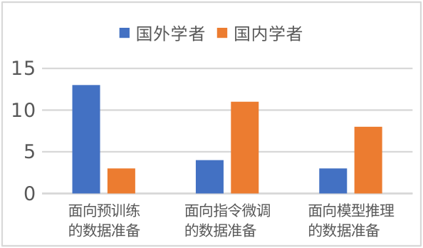

# 当前论文插图

## 图1：双树研究总览

[最终英文图](fig00_two_research_trees_v2.png)放置于引言后，第2页。两棵树各设五个任务分支，右树以铜色突出具身数据准备；分支内从较早工作延伸至近期工作，根部与树冠分别补充共同基础及综述背景。图中49个节点覆盖当前全部50项引用，其中[44,45]对应同一个数据资源。连线表示主题归属，不表示论文间的直接继承关系。

- [初始精细PROMPT](prompts/fig00_two_research_trees.md)
- [长标签换行与字号修订PROMPT](prompts/fig00_two_research_trees_edit.md)
- [全部节点与书目映射](two_research_trees_manifest.json)
- [生成和检查说明](reviews/fig00_two_research_trees.md)

采用内置image_gen生成并定向编辑一次，最终PNG保留工具原始输出，实际尺寸1086×1448像素。[初稿](fig00_two_research_trees.png)随工程保留便于复核，论文只引用最终图。

## 图2、图3：上传原稿的两幅正文图

本轮全部复用用户上传DOCX中的两幅原生统计图，不需要重新绘制。矢量PDF由原图直接渲染、裁去页边空白后嵌入LaTeX，PNG供独立预览或插入演示文稿。

| 原图 | 独立PDF | PNG预览 |
|---|---|---|
| 图1：基于语言模型的数据准备研究分布 | [PDF](original/original_lm4dp.pdf) | [PNG](original/original_lm4dp.png) |
| 图2：面向语言模型的数据准备研究分布 | [PDF](original/original_dp4lm.pdf) | [PNG](original/original_dp4lm.png) |

图1原始数据为国外学者17、6、12、16，国内学者7、13、7、11，依次对应发现、查询、融合和清洗。图2原始数据为国外学者13、4、3，国内学者3、11、8，依次对应预训练、指令微调和模型推理。这些数值均未更新，不代表2026年的完整研究分布。

LaTeX使用按原稿尺寸渲染后等比放大的矢量PDF。正文通过`main.tex`中的`articlefigure`命令引用，显示宽度为正文版心的72%。编译时直接使用随工程保存的PDF，无需重新提取或绘制。

原稿为用户本地上传的《04 数据准备与语言模型交叉技术的研究进展与发展趋势 - 编辑提问回答.docx》。提取方式为OOXML包读取及LibreOffice原生图表渲染，未调用图像生成模型。原稿、图表部件及导出文件的哈希见[provenance.json](original/provenance.json)，编译检查见[validation.json](../editorial/frontier_sources/validation.json)。本轮不修改或提交Word文件。

作者照片继续使用[fanju.jpg](fanju.jpg)与[fmh.jpg](fmh.jpg)，来源见[AUTHOR_INFO.md](../editorial/AUTHOR_INFO.md)。更早生成的三幅插图和prompt作为历史素材留存，当前稿件不引用。
