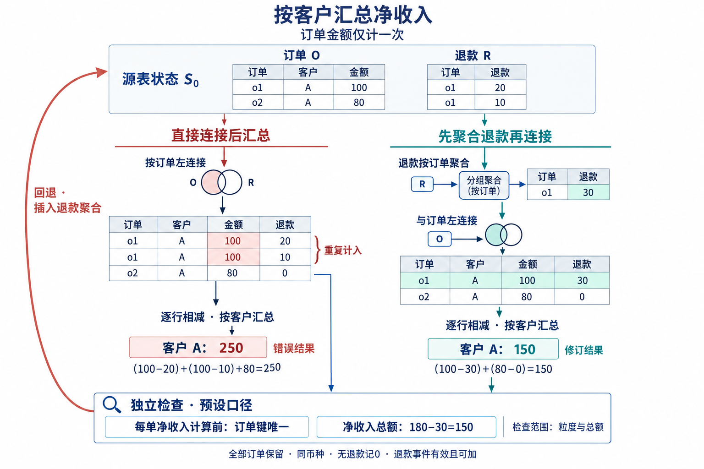

# 智能数据准备综述配图

当前正文仅保留1幅图：订单退款处理中错误传播、独立检查与回退的具体实例。原任务体系图与流程概念图已删除，对应内容改为正文说明；手工制作PPT时只需重绘下图。

[下载PNG](fig01_error_propagation.png) · [详细prompt](prompts/fig01_error_propagation.md) · [核查记录](reviews/fig01_error_propagation.md)

同一订单的金额在错误路径中重复计入，得到250；退款先按订单聚合后得到150。独立检查依据来自预先给定的任务口径。数据是作者构造的算术实例，不是系统性能结果。

此图沿用上一轮专门绘图agent调用imagegen生成的PNG，仅由原图3重编号为图1；实际1536×1024像素、RGB。当前未再次生成或编辑像素。

[生成记录与历史](GENERATION.md) · [图表删改对应说明](../editorial/SIMPLIFICATION.md)
