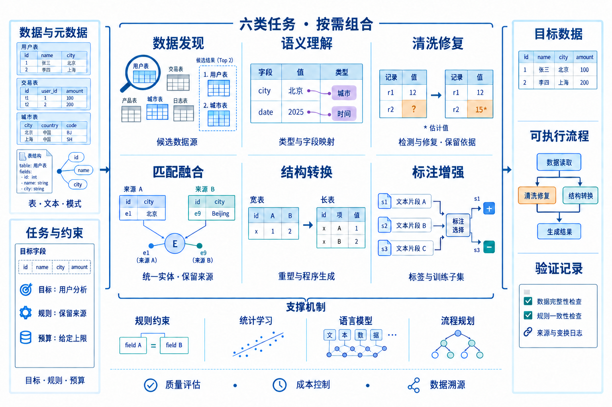
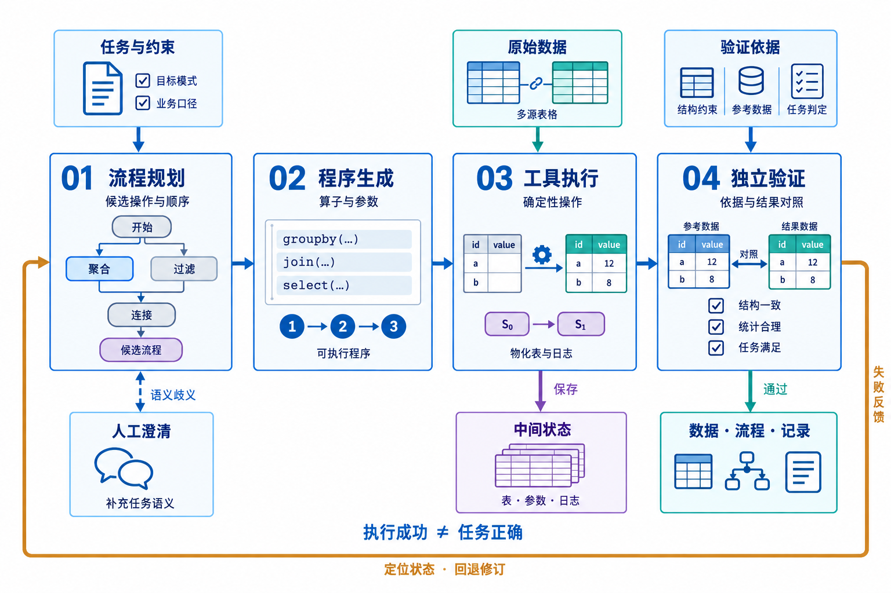
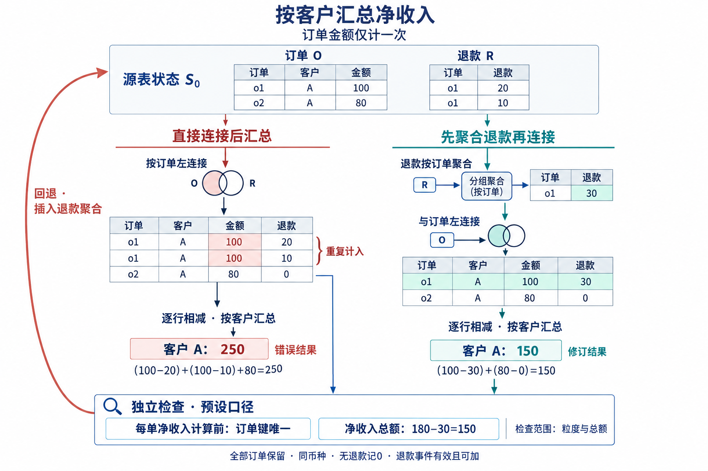

# 智能数据准备综述配图

三张图以独立PNG提供，可直接下载或插入论文、Word和幻灯片。配图由专门绘图agent调用内置imagegen生成；详细prompt、编辑过程及核查记录随仓库保存。图示属于本文综合归纳，图3金额为作者构造示例。

## 图1：任务体系

[下载PNG](fig01_taxonomy.png) · [详细prompt](prompts/fig01_taxonomy_v2.md) · [核查记录](reviews/fig01_v2.md)

六类任务可按目标组合；任务内部的小型数据示意分别说明检索、理解、修复、匹配、转换和标注。

## 图2：执行反馈与验证

[下载PNG](fig02_workflow.png) · [详细prompt](prompts/fig02_workflow_v2.md) · [核查记录](reviews/fig02_v2.md)

主链连接规划、生成、执行与验证，另展示数据输入、中间状态、验证依据、人工澄清以及反馈修订。

## 图3：错误传播与回退

[下载PNG](fig03_error_propagation.png) · [详细prompt](prompts/fig03_error_propagation_v2.md) · [核查记录](reviews/fig03_v2.md)

同一订单的金额在错误路径中重复计入，得到250；退款先按订单聚合后得到150。独立检查依据来自预先给定的任务口径。

[共同视觉规格](prompts/redesign_style.md) · [生成记录与实际文件规格](GENERATION.md)
