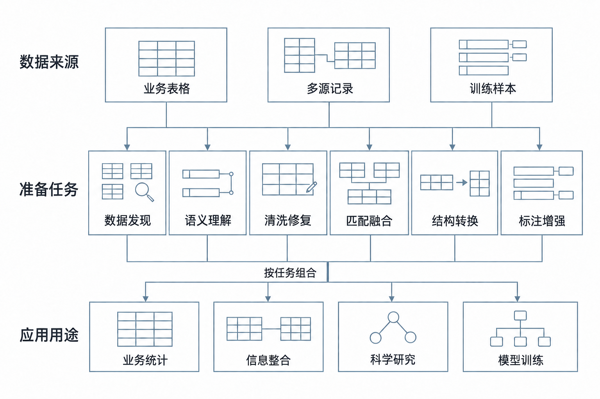
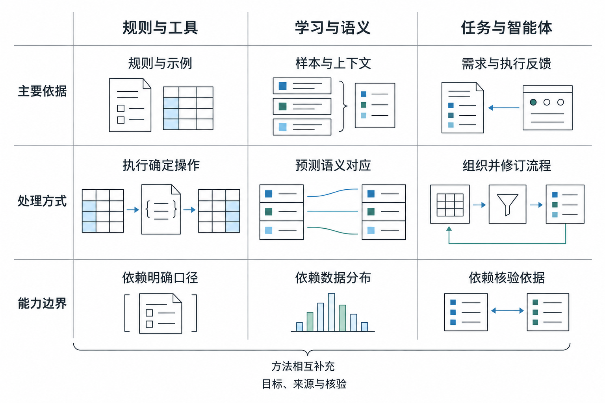
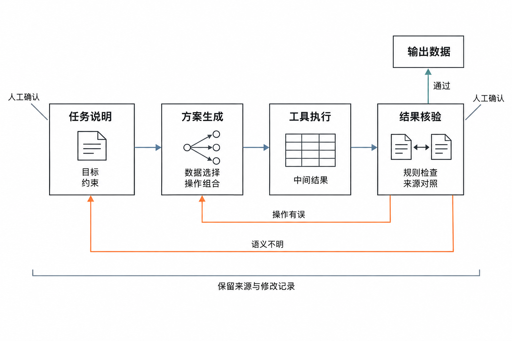

# 学术综述插图与作者照片

当前正文仅使用以下3幅学术示意图。采用白底、细线框、黑灰中文和少量蓝绿点色，删除人物场景、大色块和演示文稿式标题。PNG由LLM生成，供作者后续PPT复绘；图注和详细prompt一并保留。

## 图1 智能数据准备的任务与应用

[PNG](fig01_everyday.png) · [详细prompt](prompts/fig01_everyday.md) · [核查记录](reviews/fig01_everyday.md)

上层为业务表格、多源记录和训练样本，中层为六类准备任务，下层为业务统计、信息整合、科学研究和模型训练。共用连接线表示按用途组合，不规定六类任务的固定顺序。正文第2节说明分类边界与应用需求。

PPT复绘时保留三层矩形、六个并列任务、小型数据图标及分支汇合线即可。

## 图2 数据准备方法的能力与适用条件

[PNG](fig02_progress.png) · [详细prompt](prompts/fig02_progress.md) · [核查记录](reviews/fig02_progress.md)

按主要依据、处理方式与能力边界比较规则与工具、学习与语义、任务与智能体。微型机制图分别表达确定操作、字段对应和流程修订；底部强调方法互补。该图为正文第3节的综合归纳，不是年代分期或性能排名。

PPT复绘时使用细分隔线与少量表格、文档、节点图形，不需要重建场景插画。

## 图3 数据准备流程中的核验与修订

[PNG](fig03_trust.png) · [详细prompt](prompts/fig03_trust.md) · [核查记录](reviews/fig03_trust.md)

任务说明、方案生成、工具执行与结果核验组成主流程。语义不明时返回任务说明，操作有误时返回方案生成，修订后重新执行。人工确认与来源记录共同支持复查。图中的核验依据不表示对全部内容的正确性保证，正文第4节以订单退款实例解释其范围。

PPT复绘时保留四个节点、输出框、两条不交叉的回路线及底部记录括弧。

## 文末作者照片与描述

- [范举照片](fanju.jpg)：2933×4038像素，灰色背景半身肖像，配范举姓名及简介。
- [范梅浩照片](fmh.jpg)：990×1440像素，蓝色背景正面肖像，配范梅浩姓名及简介。

照片由用户本次提供，保持原始文件和比例，不计入正文3幅插图编号。两位作者各约150字简介排在参考文献后，详见[简介源码](../author_bios.tex)和[信息来源](../editorial/AUTHOR_INFO.md)。

[生成与来源记录](GENERATION.md)。旧演示风格候选保存在archive/overview_ppt_draft，仅记录设计过程，不进入当前论文，也无需复绘。
